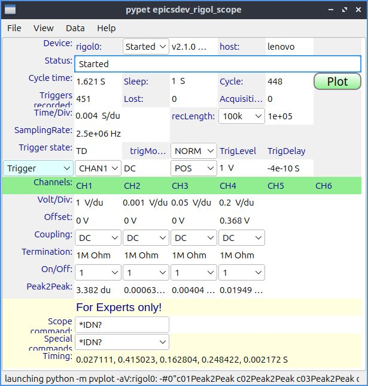
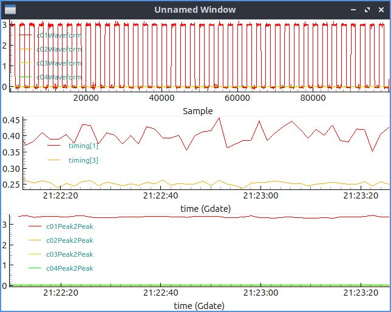

# epicsdev_rigol_scope.
Python-based EPICS PVAccess server for RIGOL oscilloscopes.
It is based on [p4p](https://epics-base.github.io/p4p/) and [epicsdev](https://github.com/ASukhanov/epicsdev) packages 
and it can run standalone on Linux, OSX, and Windows platforms.<br>
It was tested with RIGOL DHO924 on Linux.

## Installation
```pip install epicsdev_rigol_scope```<br>
For control GUI and plotting:
```pip install pypeto,pvplot```

## Run
To start: ```python -m epicsdev_rigol_scope -r'TCPIP::192.168.27.31::INSTR'```<br>
Control GUI:<br>
```python -m pypeto -irigol0: -c<path_to_repository/config> -fepicsScope```<br>

, 

## Performance
The network interface of DHO924 is 100BASE-T.
The measured data output rate is 3.3 MPPS (6.6 MB/s) for SOCKET and 2.2 MPPS (4.4 MB/s) for INSTR visa resources.
